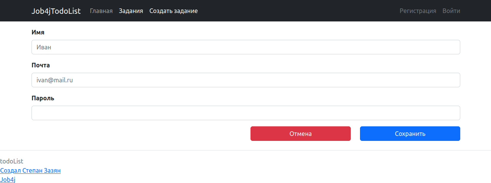
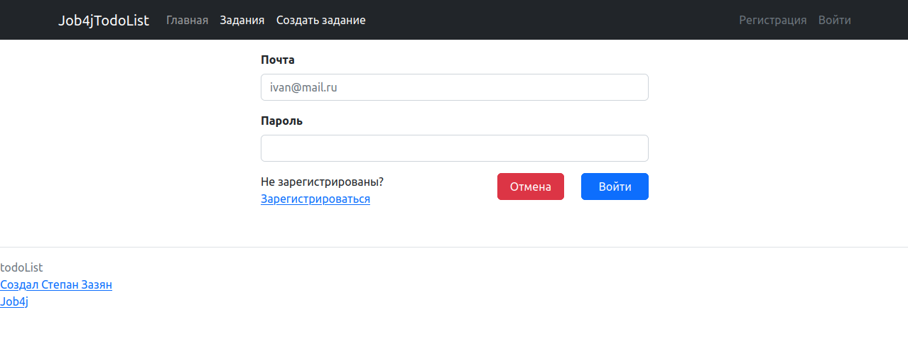
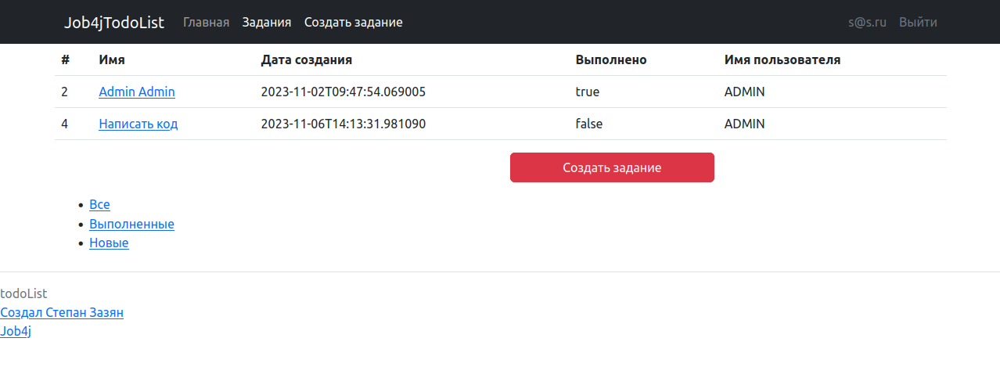
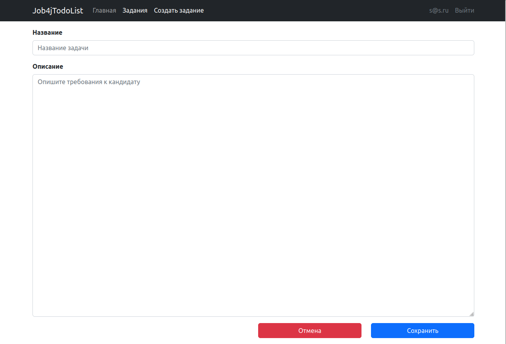
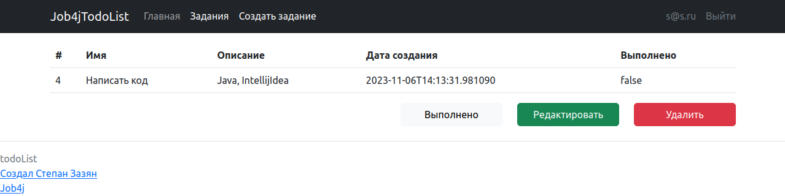

Приложение "TODO список".
1. Проект позволяет создавать список заданий, просматривать, удалять, редактировать, отмечать как выполненное.

2. Стек технологий: Spring boot, Thymeleaf, Bootstrap, Hibernate, PostgreSql 14, Java 17

3. Требования к окружению: Java 17, Maven 3.8, PostgreSQL 14

4. Запуск проекта:

   В PostgreSQL создайте базу с именем "postgres"
   '''create database postgres;'''
   Скачайте проект к себе на компьютер с помощью команды
   '''git clone https://github.com/StepanZazyan/job4j_todo'''
   Перейдите в корень проекта
   Добавьте настройки для доступа к базе данных, 
   для этого внесите соответствующие изменения в файле src/main/resources/db.properties
   и в файле конфигурации проекта pom.xml
   Выполните команду mvn install в корне проекта для его сборки
   Будет выполнена миграция БД с помощью Liquibase.
   Команда для запуска из консоли java -jar target/job4j_todo-1.0.jar после чего перейдите по данной ссылке.
   http://localhost:8080/index   в вашем браузере

5. Взаимодействие с приложением:
Регистрация

Вход

Список заданий

Создать задание

Обработка задания

6. Контакты:
stepanzazyan@yandex.ru - почта
@StepanZazyan - телеграм

